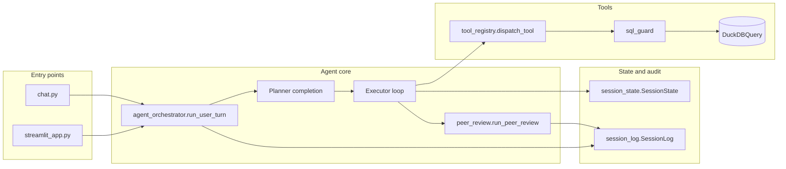

# Architecture

This document describes how the **Labs@ assessment** app is structured: entry points, the agent loop, tools, session state, and exports. Implementation files are under the repo root and `tools/`.

## High-level flow

- **Entry points** build an OpenAI client, hold the **chat message list** and **`SessionState`**, and call **`run_user_turn`** for each user message. They do not embed tool or SQL logic.
- **`run_user_turn`** (see [`agent_orchestrator.py`](agent_orchestrator.py)) updates **`SessionState`**, refreshes the **system** message from `build_system_content`, optionally runs the **planner** (one completion, no tools), then loops: **assistant completion** → **tool calls** → **`dispatch_tool`** → append tool messages → repeat until the assistant returns text without tools.
- After a successful turn with a final answer, **`run_peer_review`** runs a second **no-tools** completion using evidence from the current turn (see [`peer_review.py`](peer_review.py)).

## Planner

- **Purpose:** Produce a short **numbered plan** (tables, joins, intent) before any database tools run.
- **Mechanism:** A separate `chat.completions.create` call with `PLANNER_SYSTEM` and **no** `tools` parameter. The plan is appended to the thread as an assistant message so the **executor** sees it.
- **Disable:** Set environment variable `DISABLE_PLANNER=1` to skip the planner call; the executor runs immediately with the same user message and system context.
- **Code:** [`agent_orchestrator.py`](agent_orchestrator.py) (`PLANNER_SYSTEM`, `run_user_turn`).

## Tool registry

- **Schemas:** `OPENAI_TOOLS` lists OpenAI function definitions (`list_tables`, `query_database`, `summarize_sql_stats`, `describe_table`, `table_info`, `profile_table`, `create_chart`).
- **Dispatch:** `dispatch_tool(name, arguments, db, state)` is the **only** path that executes tool behavior. SQL paths use **`query_with_columns_timed`** from [`tools/sql_guard.py`](tools/sql_guard.py) (LIMIT policy + timeout), not raw unguarded execution.
- **Session side effects:** On success, tools may call `SessionState` methods (`note_sql`, `note_cohort_sql`, `note_table`, `note_chart`, etc.) and the **query cache** for `query_database` / `summarize_sql_stats`.
- **Code:** [`tools/tool_registry.py`](tools/tool_registry.py).

## Session state

- **`SessionState`** holds **rolling context** for the current chat session: latest user request snippet, last SQL, last cohort SQL (for “same cohort” follow-ups), recent tables, chart paths, etc.
- **`context_block()`** renders markdown that is appended to the **system** prompt via `build_system_content` so the model stays grounded across turns.
- **Not persisted** across process restarts (in-memory only).
- **Code:** [`tools/session_state.py`](tools/session_state.py).

## Session log and exports

- **`SessionLog`** records each user turn: user text, planner text, tool rounds (function name, arguments, results), assistant reply, and peer review text.
- **`to_markdown()` / `save()`** write an audit report: executive summary, reproducibility metadata, per-turn detail, redacted SQL/tool JSON where appropriate, and a session digest footer.
- **Code:** [`session_log.py`](session_log.py). Reports go to `outputs/reports/` (e.g. terminal `export` or Streamlit download).

## SQL guard and errors

- **`validate_exploration_sql`** enforces **LIMIT** on `SELECT ... FROM ...` and rejects multi-statement batches.
- **`query_with_columns_timed`** runs approved SQL with a **wall-clock timeout** (DuckDB interrupt).
- Failed tool results may include **heuristic** `error_kind` / `next_step` from [`tools/sql_error_hints.py`](tools/sql_error_hints.py).

## Related docs

- Root **[README.md](README.md)** — setup, usage, feature list.
- **[examples/README.md](examples/README.md)** — SQL and demo narratives, including **cohort + care gap** demo.
- **`tools/db_query.py`** — provided as-is; load path for `healthcare.duckdb`.
