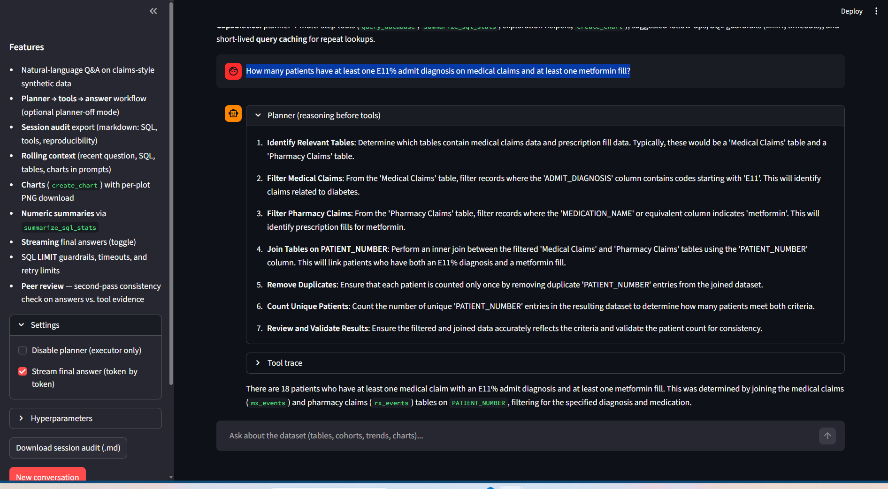

# Healthcare Analytics Agent

## What I Built

Healthcare analysts spend hours writing SQL to answer questions they ask every week. This submission extends the starter chat into a structured analyst assistant that plans before acting, catches its own mistakes, and leaves a complete audit trail of every query it ran.

The core insight driving my design: in production healthcare analytics, **reproducibility and trust** matter as much as the answer itself. An analyst cannot rely on a result they cannot explain or reproduce. Every design decision flows from that.

### What it does differently from the starter:

- **Plans before querying** — the agent writes an explicit step-by-step plan before touching the database, so complex multi-table questions don't waste expensive query calls.

- **Self-corrects SQL errors** — when a query fails, the agent revises and retries (capped at 2 attempts in code, not just prompt, to prevent token loops).

- **Leaves an audit trail** — every session exports a structured markdown report: what was asked, what SQL was run, what the results were.

- **Peer review pass** — after each answer, a second LLM pass checks the response against the actual tool evidence and flags inconsistencies.

- **Cohort continuity** — **session state** stores the last successful cohort-defining SQL (from `query_database` / `summarize_sql_stats` / `create_chart`) and injects it into the system prompt so follow-ups like “same cohort” resolve to a concrete definition; the model still uses the standard SQL tools—there is no separate “cohort” tool.

- **Streamlit UI** — optional web interface with streaming responses and in-chat chart rendering.

---
## Architecture Decisions

### Why a planner + executor split?
The starter `chat.py` reacts to questions directly: it calls tools until it has an answer. For complex healthcare questions that need 3-4 joined tables, this wastes expensive query calls on wrong approaches. The planner step (one LLM call without tools) forces the agent to think before acting. In testing, this reduced failed SQL attempts on multi-table questions significantly.

### Why enforce the SQL retry cap in code, not prompt?
Prompt instructions can be ignored by the model under certain conditions. A runaway tool loop on a 2.5M row table is expensive. The cap lives in agent_orchestrator.py as a hard counter — no matter what the model decides, it cannot issue more than 2 failed SQL calls per turn.

### Why markdown export over PDF?
Markdown is diffable, email-friendly, and readable without tooling. For a team reviewing 10 candidate submissions, opening a .md file is faster than rendering a PDF. It also means the export itself can be version-controlled.

### Why peer review as a second LLM pass?
Healthcare analytics has real stakes. An agent that confidently states a wrong number about patient cohorts is worse than one that says "I'm not sure." The peer review pass catches cases where the final answer doesn't match what the tool results actually 
showed, a lightweight trust layer without a full eval pipeline.

### Why a tool registry pattern?
The starter has all tool logic inside chat.py. Adding a new tool means editing the main loop. 
The registry pattern (tool_registry.py) means new tools are added in one place — schema + 
handler together. The chat loop never changes.

### Why session state in the system prompt?
Lightweight cross-turn memory without a vector store. Tracks last SQL, last cohort definition, and recently touched tables. This means "show me the same cohort but by state" resolves correctly without the user repeating themselves.

---

## System Design Tradeoffs handled

### 1. Planner + Executor vs Single Pass
Extra LLM call before tools, but saves wasted SQL 
attempts on complex multi-table questions against 
2.5M row tables. `DISABLE_PLANNER=1` skips it when 
speed matters more.

### 2. SQL Guardrails vs Flexibility
`sql_guard.py` enforces LIMIT, row caps, 
single-statement only, and wall-clock timeout. 
Power users lose arbitrary SQL; everyone gains 
predictable cost and runtime.

### 3. Retry Cap in Code, Not Prompt
Hard counter in `agent_orchestrator.py` — after 2 
failed SQL calls per turn, returns 
`retry_limit_reached`. Prompt instructions can be 
ignored by the model; a code counter cannot.

### 4. Session State vs Vector Store
Rolling context (last SQL, cohort definition, 
touched tables) injected into system prompt each 
turn. No vector DB, no persistence — cheap and 
simple for session-length memory.

### 5. Peer Review vs Cost
Second LLM pass after every turn checks the answer 
against actual tool evidence. Known tradeoff: same 
model shares same biases. A different model as 
reviewer is the right next step.

### 6. Query Cache vs Freshness
In-memory TTL cache (~5min) for identical SQL calls. 
Charts never cached. Session-only — no stale results 
across restarts.


**Architecture (planner, tools, session state, exports):** [`ARCHITECTURE.md`](ARCHITECTURE.md).

## Entry points vs agent core

| What | Role |
|------|------|
| [`chat.py`](chat.py) | Terminal REPL: OpenAI client, message list, `SessionState`, `SessionLog`; calls **`run_user_turn`** per user line. No tool/SQL logic here—only I/O and `export` / exit. |
| [`streamlit_app.py`](streamlit_app.py) | Same as `chat.py`: holds the same structures and calls **`run_user_turn`**. Adds UI (streaming, follow-up buttons, download audit). |
| [`agent_orchestrator.py`](agent_orchestrator.py) | Single agent implementation: with optional planner, executor tool loop, peer review, system prompt refresh. Both UIs depend on this module only. |

## Features

- **Streamlit** UI with full message history with a configurable system prompt (rolling context includes the **latest user request** to ground suggested follow-ups, plus **cohort memory**: last successful SQL from `query_database` / `summarize_sql_stats` / `create_chart` so phrases like “same cohort” resolve to a concrete definition). Streamlit can **stream the final answer** token-by-token (sidebar toggle).
- GPT-4o + tools: `list_tables`, `query_database`, `summarize_sql_stats`, `describe_table`, `table_info`, `profile_table`, `create_chart`
- **Query result cache** (in-memory, TTL ~5m): identical `query_database` / `summarize_sql_stats` calls reuse JSON results (errors are not cached). Charts are not cached (each run writes a new PNG).
- Optional **planner** step (one completion without tools), then **executor** loop with multi-round tool calls.
- Markdown export: type `export`, or `exit` — writes `outputs/reports/session_<timestamp>.md` with an **Executive summary** (turn/SQL/chart/table counts), **reproducibility** block, per-turn log, **Session digest** footer, and **error_kind** / **next_step** on tool SQL failures (heuristic, no extra LLM)
- SQL: `SELECT ... FROM ...` must include **`LIMIT n`** (enforced in [`tools/sql_guard.py`](tools/sql_guard.py)); long-running queries can hit a **wall-clock timeout** (DuckDB interrupt)
- SQL guardrail: after two failed `query_database` results in one user turn, further SQL for that turn returns `retry_limit_reached`
- **Peer review** : after each successful turn, a second **no-tools** LLM pass compares the final answer to tool evidence ([`peer_review.py`](peer_review.py)).


**Example SQL:** see [`examples/README.md`](examples/README.md). **Primary demo narrative:** [`examples/demo_cohort_and_care_gap_workflow.md`](examples/demo_cohort_and_care_gap_workflow.md) (cohort + care gap + optional chart). Supporting docs: [`examples/diabetes_workflow_sql_examples.md`](examples/diabetes_workflow_sql_examples.md), [`examples/time_to_metformin_sql_examples.md`](examples/time_to_metformin_sql_examples.md), [`examples/cost_and_chart_sql_examples.md`](examples/cost_and_chart_sql_examples.md), [`examples/cohort_trends_note.md`](examples/cohort_trends_note.md).


## Database tools

- **list_tables** — List tables
- **query_database** — Run SQL (results cached briefly when identical)
- **summarize_sql_stats** — Numeric column summaries (min/max/mean/std/quartiles) on guarded SQL; set `value_column` if multiple numeric columns
- **describe_table** / **table_info** — Schema and samples
- **profile_table** — DuckDB `SUMMARIZE` on a capped sample
- **create_chart** — Two-column SQL (same `sql_guard` as `query_database`) + required **title** (cohort, metric, time/breakdown) → PNG under `outputs/visualization/`

## Available tables

**Patient / events:** demographics, geography, mortality, mx_events, rx_events  

**Code lookups:** icd10_codes, procedure_codes, ndc_products  

Join on `PATIENT_NUMBER`.

## Prerequisites

- Python 3.13+
- [uv](https://github.com/astral-sh/uv)
- OpenAI API key ([platform.openai.com](https://platform.openai.com/api-keys))

## Setup

### Quick (macOS/Linux with `make` and `unzip`)

```bash
make all
```

### Windows (PowerShell)

```powershell
uv sync
Expand-Archive -Path "data\input.zip" -DestinationPath "data" -Force
uv run python data\generate_data.py
uv run python scripts\load_archives_to_duckdb.py
```

If `generate_data.py` fails on NumPy `int32` bounds, use `dtype=np.int64` for large `randint` (see `data/generate_data.py`).

### Manual Setup

1. **Install dependencies:**

   ```bash
   make install
   # or: uv sync
   ```

2. **Generate the healthcare data:**

   ```bash
   make generate-data
   ```

   This generates synthetic patient data CSVs in `data/`.

3. **Set up the database:**

   ```bash
   make setup-db
   # or: uv run python scripts/load_archives_to_duckdb.py
   ```

   This loads all CSV files from `data/` into `healthcare.duckdb`.

4. **Configure your OpenAI API key:**

   Create a `.env` file in the project root:

   ```bash
   cp env.template .env
   ```

   Then edit `.env` and replace `your_api_key_here` with your actual OpenAI API key:

   ```
   OPENAI_API_KEY=sk-...your-actual-key...
   ```

   Note: The `.env` file is gitignored to protect your API key.

### Makefile

- `make install` — dependencies
- `make generate-data` — synthetic CSVs
- `make setup-db` — load DB
- `make clean-db` / `make test-db` / `make all` / `make help`

## Usage

```bash
uv run chat.py
```

**Web UI (Streamlit):** same agent stack as `chat.py` (see [Entry points](#entry-points-vs-agent-core)); sidebar has session audit download and settings; charts show in-chat with a per-plot download button.

```bash
uv run streamlit run streamlit_app.py
```

**Commands:** normal chat; **`export`** writes session markdown to `outputs/reports/`; **`exit`** / **`quit`** ends (and exports if there is content); **Ctrl+C** same as exit.


## Tests

```bash
uv sync --extra dev
uv run pytest
```

- **Unit / policy tests** (no DB): `test_sql_guard.py`, `test_sql_error_hints.py`, `test_query_cache.py`, `test_session_log.py`, `test_session_digest.py`, `test_session_state.py`, `test_peer_review.py` (mocked OpenAI).
- **Integration tests** (require `healthcare.duckdb`): `test_tool_registry.py` — skipped automatically if the database file is missing.

## Design notes

- **Export:** Markdown for review/diffs; SQL failure cap enforced in code; no edits to `db_query.py`.
- **Registry:** Tool schemas and handlers live in `tool_registry.py`. Session context in the system prompt; suggested follow-ups via prompt (no extra API call).
- **Charts:** matplotlib non-interactive backend; chart tool expects two result columns.
- **Streaming:** Streamlit passes `stream_delta` / `stream_reset` into [`run_user_turn`](agent_orchestrator.py) so executor completions stream over the Chat Completions streaming API; terminal `chat.py` uses non-streaming completions.

Details: [`ARCHITECTURE.md`](ARCHITECTURE.md).


## Example Workflows

Reference docs:
- Index: [`examples/README.md`](examples/README.md)
- [`examples/diabetes_workflow_sql_examples.md`](examples/diabetes_workflow_sql_examples.md)
- [`examples/time_to_metformin_sql_examples.md`](examples/time_to_metformin_sql_examples.md)
- [`examples/cost_and_chart_sql_examples.md`](examples/cost_and_chart_sql_examples.md)
- [`examples/demo_cohort_and_care_gap_workflow.md`](examples/demo_cohort_and_care_gap_workflow.md)

Session audit markdown under `outputs/reports/` and chart PNGs under `outputs/visualization/` are gitignored; generate locally.

Session audit markdown under `outputs/reports/` and chart PNGs under `outputs/visualization/` are gitignored; generate locally.

### Example 1: Diabetes + metformin cohort count (Streamlit)

**User query**

> How many patients have at least one E11% admit diagnosis on medical claims and at least one metformin fill?

Screenshot (place your capture at `screenshots/diabetes_cohort1.png`):



**Planner (outline before tools)** — illustrative; wording varies by run:

```text
1. Use mx_events to find distinct PATIENT_NUMBER with ADMIT_DIAGNOSIS_CODE LIKE 'E11%'.
2. Use rx_events to find distinct PATIENT_NUMBER with metformin in GENERIC_NAME.
3. Inner-join those sets and COUNT DISTINCT patients; return one row (LIMIT 1).
```

**Tool round** — `query_database` with SQL along these lines:

```sql
WITH dm_patients AS (
  SELECT DISTINCT "PATIENT_NUMBER"
  FROM mx_events
  WHERE "ADMIT_DIAGNOSIS_CODE" LIKE 'E11%'
),
metf AS (
  SELECT DISTINCT "PATIENT_NUMBER"
  FROM rx_events
  WHERE LOWER(COALESCE("GENERIC_NAME", '')) LIKE '%metformin%'
)
SELECT COUNT(DISTINCT m."PATIENT_NUMBER") AS patients_dm_and_metformin
FROM metf AS m
INNER JOIN dm_patients AS d ON m."PATIENT_NUMBER" = d."PATIENT_NUMBER"
LIMIT 1;
```

**Tool result (abbreviated)** — JSON shape returned to the model:

```json
{
  "columns": ["patients_dm_and_metformin"],
  "rows": [[12345]],
  "total_rows": 1,
  "truncated": false
}
```

*(Replace `12345` with the value from your loaded database; synthetic data varies by seed.)*

**Final answer (illustrative)** — natural-language summary grounded in the tool row count:

```text
There are 12,345 distinct patients who have at least one medical claim line with an E11%
admit-diagnosis pattern and at least one metformin fill in rx_events. The cohort is defined
as the intersection of those two patient sets (JOIN on PATIENT_NUMBER).
```

**Suggested follow-ups** — from the assistant’s closing section (exact bullets vary):

```markdown
### Suggested follow-ups
- **Stratify by state:** For this same cohort, break the patient count down by PATIENT_STATE using geography/demographics.
- **LAB utilization:** Among E11 patients, compare those with vs. without VISIT_TYPE = 'LAB' on mx_events.
- **Trend:** Chart monthly metformin fills over time for patients in this cohort (create_chart, two columns).
```

**Peer review (Reviewer Evaluation)** — second pass; illustrative:

```markdown
### Verdict
**Pass** — The stated patient count matches the single-row result from `query_database`.

### Checks
- Numeric claim in the answer aligns with tool JSON `rows[0][0]` for `patients_dm_and_metformin`.
- SQL uses E11% on mx_events and metformin pattern on rx_events as described.

### Risks
- E11 on a claim line is a documentation proxy, not a full diabetes registry; metformin indicates at least one fill, not adherence.
```


## Possible next steps

1. **Mandatory chart narrative** — Currently create_chart produces a PNG but the
agent decides whether to describe it. A small post-processing step after every chart call would force one sentence of plain English interpretation ("The chart shows California has the highest diabetic-metformin cohort concentration at 12%"). This closes the gap between a visualization and an insight.

2. **Ranked follow-up suggestions** — The current follow-ups are generated by the same
LLM call that produces the answer. A lightweight scoring step (rule-based or small model) would rank candidates by: dataset relevance, novelty relative to session history, and analytical depth. This prevents repetitive follow-ups across turns.

3. **Different reviewer model** — The peer review currently uses the same GPT-4o
model that produced the answer, which means it shares the same biases and blind spots. Using a different model (Claude, Gemini) as the reviewer creates genuine intellectual diversity. The reviewer is less likely to validate a flawed answer it didn't produce.

4. **Role-based permissions** — Restrict which tables or tools each user role may call, configured above the tool registry.

5. **Async long queries** — Long-running queries currently block the entire
chat loop. An async execution layer would let the agent continue the conversation ("still
running your query, here's what I found so far") while waiting for expensive aggregations to complete.

6. **Multi-agent split** — Replace the single planner+executor with specialized agents that the orchestrator delegates to:

  Orchestrator
  ├── Data Analyst Agent  (SQL + stats)
  ├── Visualization Agent (chart decisions)
  └── Report Writer Agent (narrative + export)

Each agent has its own system prompt tuned to its role. The orchestrator decides which agent handles which part of a complex question. This mirrors how Meerkat likely works in production.

